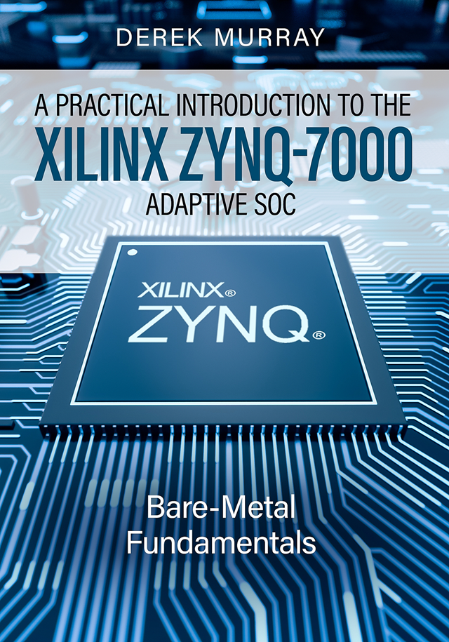

# Introduction
Supplementary material for the book: **"A Practical Introduction to the Xilinx Zynq-7000 Adaptive SoC - Bare-Metal Fundamentals"**, written by Derek Murray.

## Update 21st June 2023: Free Digital Downloads of First Edition
Two digital versions of the first edition are now freely available in the [BOOK-FREE DOWNLOAD](https://github.com/der-mur/book1-zynq-intro/tree/master/BOOK-FREE%20DOWNLOAD) directory:

### [Kindle eBook Edition (MOBI)](https://github.com/der-mur/book1-zynq-intro/tree/master/BOOK-FREE%20DOWNLOAD/kindle-ebook-reader-mobi))
This mobi version is optimised for Amazon Kindle eBook Readers. It has been tested on the Kindle Paperwhite (6th edition), but should render fine on many other versions. Simply connect your Kindle to your PC just like a storage device, and copy the MOBI file to the Kindle; it should then appear in your book list on the device. Note that the MOBI version can also be viewed using the Kindle for PC app, but the images are low-res gray-scale gifs which don't look amazing on that software.

### [epub Edition](https://github.com/der-mur/book1-zynq-intro/tree/master/BOOK-FREE%20DOWNLOAD/epub)
This epub edition has been created with high resolution diagrams, which makes the file size quite large (93 MB). It can be viewed on many freely-available epub readers, but it looks much better on some than others (for example, I found that it renders very well on [Sumatra PDF](https://www.sumatrapdfreader.org/free-pdf-reader) and [Calibre](https://calibre-ebook.com/); note that I have no affiliation with either company). The epub version can also be viewed on the Kindle for PC app - to do this, you need to send it to your Kindle library. ([See this link.](https://www.amazon.com/sendtokindle))

## Main Supplementary Material

### Step-By-Step Guides (+ TCL Flow!)
The most important content is found in the [step-by-step](step-by-step) directory; this contains comprehensive documents for developing the FPGA design and software projects in the textbook, along with the C code and FPGA constraint files. (The source files are found in the [files_for_import](step-by-step/files_for_import) directory.) The Digilent Zybo-Z7-20 is the main platform supported, although the Zybo-Z7-10 can also be used with no changes to C code or constraints. Files are also included for the Digilent/Avnet ZedBoard.

Two development flows are covered: 
1. **Vivado HLx plus Xilinx SDK** (Vivado-SDK Flow.pdf); For Xilnx software versions up to and including 2019.1.
1. **Vivado HLx plus Vitis IDE** (Vivado-Vitis IDE Flow.pdf); For Xilinx software versions >= 2020.1. (Note that Vivado HLx has been rebranded as Vivado ML Edition in June 2021.)

An optional guide for preparing the Zybo-Z7-20/10 platform is also provided ("Prepare Board Files.pdf").

**Update 26th September 2021: TCL Flow added:**
If the reader does not want to build the FPGA project in IP Integrator, they can instead use a TCL flow. This implements the design as far as the hardware hand-off stage; refer to ***TCL Flow.pdf*** in the [step-by-step](step-by-step) folder for comprehensive instructions.

### Host Applications
The host applications developed in Chapter 15 of the textbook are also provided in the [host_apps](host_apps) directory. Currently, LabVIEW and Python examples are provided:
1. **LabVIEW**: The LabVIEW application is developed in LabVIEW Community Edition, and it is packaged in JKI VIPM format. A PDF doc is also provided with software download locations and package installation instructions.
2. **Python**: The python code is provided in the form of a Jupyter notebook (.ipynb format).

### Digilent Analog Discovery Logic Analyser Project Files
In the [digilent_waveforms_workspaces](digilent_waveforms_workspaces) directory, logic analyser set-up files are provided for Projects 4-10 in the textbook. The test connections match those found in the text.

### Tera Term configuration file
The authors Tera Term configuration file can be found in the [teraterm_config](teraterm_config) directory.

